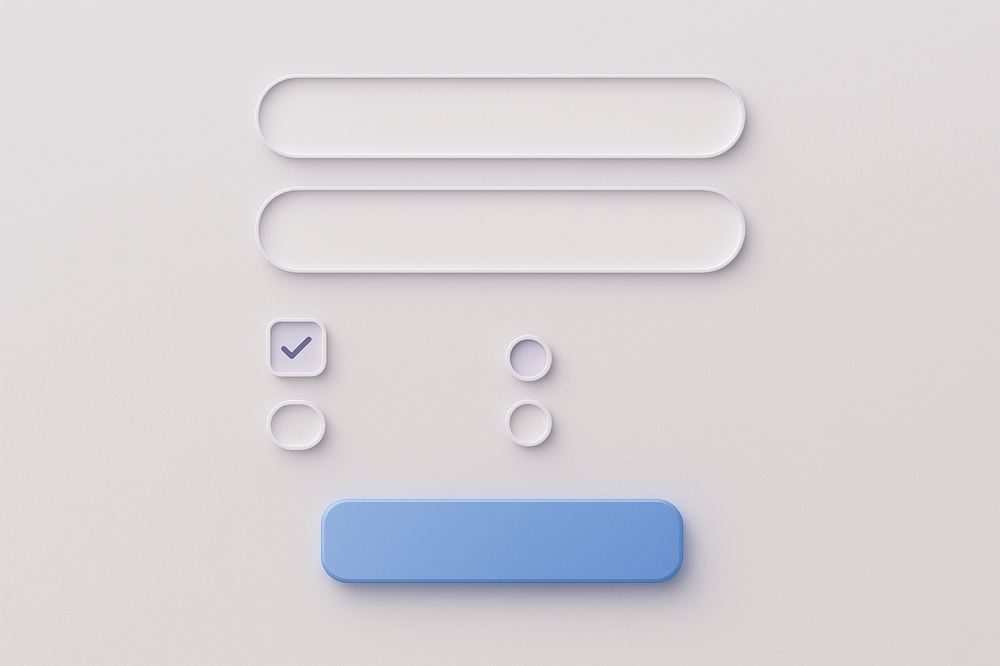
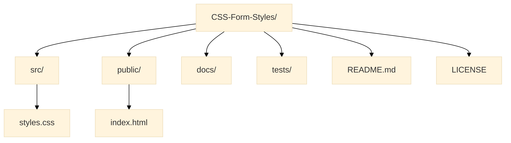

# CSS Form Styles

[](https://github.com/galafis/CSS-Form-Styles/actions) [](LICENSE)

[English](README.md#en-us) | [Português](README.md#pt-br)

---

<a name="pt-br"></a>

## 🇧🇷 Português

## 🖼️ Imagem Hero



## Descrição

**CSS Form Styles** é uma biblioteca de estilos CSS moderna e profissional, desenvolvida por Gabriel Demetrios Lafis, para aprimorar a aparência e a usabilidade de formulários web. Este projeto oferece um conjunto abrangente de componentes de formulário estilizados, prontos para serem integrados em qualquer projeto HTML, garantindo uma experiência de usuário consistente e visualmente atraente.

## Funcionalidades

*   **Estilos Profissionais**: Design limpo e moderno para todos os elementos de formulário.
*   **Responsividade**: Otimizado para funcionar perfeitamente em dispositivos de todos os tamanhos.
*   **Fácil de Usar**: Integração simples com qualquer projeto HTML.
*   **Componentes Abrangentes**: Estilos para inputs de texto, selects, checkboxes, radio buttons, textareas, file inputs e botões.
*   **Estados de Validação**: Suporte visual para estados de sucesso e erro.
*   **Acessibilidade**: Foco na usabilidade e acessibilidade.

## Demonstração

Visualize os estilos em ação na [página de demonstração](https://gabrieldemetrioslafis.github.io/CSS-Form-Styles/).

## Instalação

Para utilizar os estilos em seu projeto, siga os passos abaixo:

1.  **Clone o repositório:**

    ```bash
    git clone https://github.com/galafis/CSS-Form-Styles.git
    ```

2.  **Copie os arquivos:**
    Copie o arquivo `styles.css` da pasta `src/` para o diretório de estilos do seu projeto.

3.  **Link no seu HTML:**
    Adicione a seguinte linha no `<head>` do seu arquivo HTML:

    ```html
    <link rel="stylesheet" href="path/to/your/styles.css">
    ```

## Uso

Os estilos são aplicados automaticamente aos elementos de formulário com as classes CSS apropriadas. Consulte o arquivo `public/index.html` para exemplos de uso de cada componente.

### Exemplo de Input de Texto

```html
<div class="form-group">
    <label for="name">Nome</label>
    <input type="text" id="name" class="form-input" placeholder="Digite seu nome">
</div>
```

### Exemplo de Botão Primário

```html
<button class="btn btn-primary">Enviar</button>
```

## Estrutura do Projeto



## Contribuição

Contribuições são bem-vindas! Sinta-se à vontade para abrir issues ou enviar pull requests.

## Licença

Este projeto está licenciado sob a Licença MIT. Veja o arquivo [LICENSE](LICENSE) para mais detalhes.

## Autor

**Gabriel Demetrios Lafis**

*   [GitHub](https://github.com/galafis)
*   [LinkedIn](https://www.linkedin.com/in/gabriel-demetrios-lafis/)

---

<a name="en-us"></a>

## 🇬🇧 English

## 🖼️ Hero Image


## Description

**CSS Form Styles** is a modern and professional CSS styling library, developed by Gabriel Demetrios Lafis, designed to enhance the appearance and usability of web forms. This project offers a comprehensive set of styled form components, ready to be integrated into any HTML project, ensuring a consistent and visually appealing user experience.

## Features

*   **Professional Styles**: Clean and modern design for all form elements.
*   **Responsiveness**: Optimized to work perfectly on devices of all sizes.
*   **Easy to Use**: Simple integration with any HTML project.
*   **Comprehensive Components**: Styles for text inputs, selects, checkboxes, radio buttons, textareas, file inputs, and buttons.
*   **Validation States**: Visual support for success and error states.
*   **Accessibility**: Focus on usability and accessibility.

## Demo

See the styles in action on the [demo page](https://gabrieldemetrioslafis.github.io/CSS-Form-Styles/).

## Installation

To use the styles in your project, follow these steps:

1.  **Clone the repository:**

    ```bash
    git clone https://github.com/galafis/CSS-Form-Styles.git
    ```

2.  **Copy the files:**
    Copy the `styles.css` file from the `src/` folder to your project's styles directory.

3.  **Link in your HTML:**
    Add the following line to the `<head>` of your HTML file:

    ```html
    <link rel="stylesheet" href="path/to/your/styles.css">
    ```

## Usage

Styles are automatically applied to form elements with the appropriate CSS classes. Refer to the `public/index.html` file for examples of how to use each component.

### Text Input Example

```html
<div class="form-group">
    <label for="name">Name</label>
    <input type="text" id="name" class="form-input" placeholder="Enter your name">
</div>
```

### Primary Button Example

```html
<button class="btn btn-primary">Submit</button>
```

## Contribution

Contributions are welcome! Feel free to open issues or submit pull requests.

## License

This project is licensed under the MIT License. See the [LICENSE](LICENSE) file for more details.

## Author

**Gabriel Demetrios Lafis**

*   [GitHub](https://github.com/galafis)
*   [LinkedIn](https://www.linkedin.com/in/gabriel-demetrios-lafis/)

